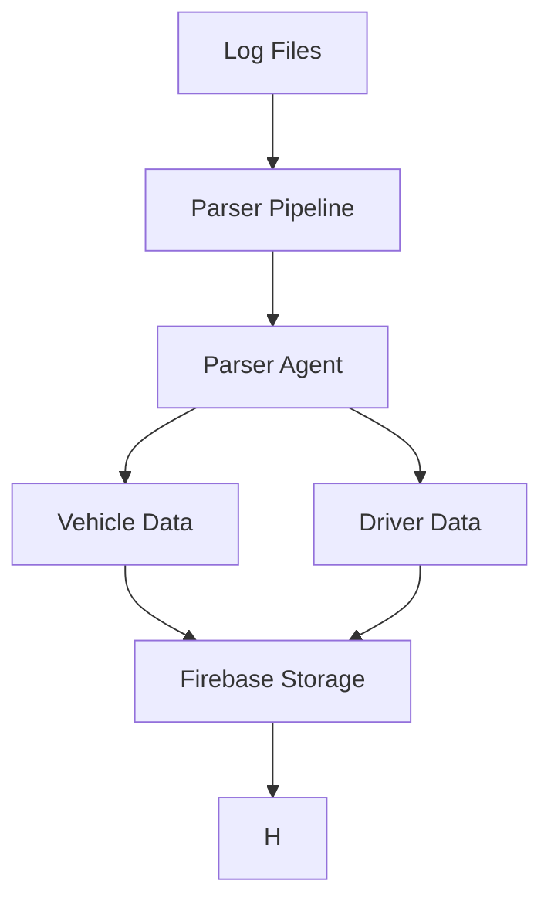

# Drivers Monitor System

A comprehensive system for monitoring and analyzing driver and vehicle data using AI agents and Firebase integration.

## Project Overview

This project implements an intelligent monitoring system that processes and analyzes driver and vehicle data using AI agents. The system uses a modular architecture with separate components for parsing, analysis, and data storage.

## System Architecture



## Components

### 1. Parser Pipeline
- Main orchestrator for log processing
- Handles file reading and data distribution
- Implements handler pattern for modular processing

### 2. Parser Agent
- AI-powered log analysis
- Extracts relevant information from logs
- Processes both vehicle and driver data

### 3. Data Storage
- Firebase integration for secure data storage
- Separate storage for vehicle and driver data
- Real-time data synchronization


## Specialized Agents

### Vehicle Data Agent
The Vehicle Data Agent is responsible for monitoring and analyzing vehicle health and performance:

#### Features
- Monitors key vehicle components:
  - Tires
  - Engine
  - Fuel system
  - Brakes
  - Battery
- Generates health scores (1-10) for each component
- Provides detailed condition summaries
- Offers actionable maintenance recommendations

#### Output Format
```python
{
    "vehicle_id": int,
    "vehicle_part": str,
    "health_score": int,  # 1-10
    "summary": str,
    "recommendations": List[str]
}
```

### Driver Data Agent
The Driver Data Agent focuses on monitoring driver behavior and health:

#### Features
- Tracks driver events and conditions
- Evaluates overall driver performance
- Monitors driver health and behavior patterns
- Generates personalized improvement recommendations

#### Output Format
```python
{
    "driver_id": int,
    "vehicle_id": int,
    "score": int,  # 1-10
    "summary": str,
    "recommendations": List[str]
}
```

## Project Structure

```
drivers_monitor/
├── logs_parser/
│   ├── parser_agent.py
│   ├── parser_pipeline.py
│   ├── parser_agent_tools.py
│   └── __init__.py
├── vehicle_data/
│   ├── vehicle_check_agent.py
│   ├── vehicle_agent_tools.py
│   ├── vehicle_local_test.py
│   └── __init__.py
├── driver_data/
│   ├── drivers_health_agent.py
│   ├── driver_agent_tools.py
│   ├── local_tests.py
│   └── __init__.py
├── secret_keys/
└── .venv/
```

## Setup Instructions

1. Clone the repository
2. Create and activate a virtual environment:
   ```bash
   python -m venv .venv
   source .venv/bin/activate  # On Unix/macOS
   # or
   .venv\Scripts\activate  # On Windows
   ```
3. Install dependencies:
   ```bash
   pip install -r requirements.txt
   ```
4. Set up Firebase:
   - Get your Firebase credentials from the Firebase Console
   - Save them as `firebase-credentials.json` in the `secret_keys` directory

## Usage

1. Place log files in the appropriate directory
2. Run the parser pipeline:
   ```bash
   python -m logs_parser.parser_pipeline
   ```
3. View results in the Firebase Console

## Security

- Firebase credentials are stored securely in the `secret_keys` directory
- Sensitive data is not committed to version control
- All API keys and credentials are properly managed

## Contributing

1. Fork the repository
2. Create a feature branch
3. Commit your changes
4. Push to the branch
5. Create a Pull Request

## License

This project is licensed under the MIT License - see the LICENSE file for details.

## Contact

For any questions or support, please open an issue in the repository. 